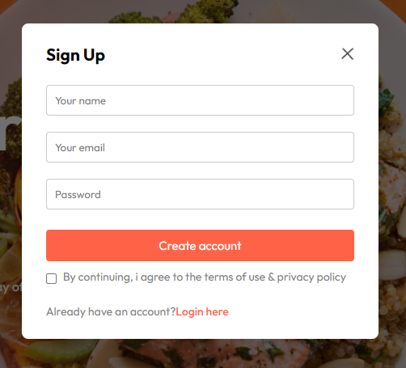

# React Restaurant Platform

This sophisticated React application is designed to offer a seamless restaurant experience. Users can effortlessly browse the menu, add selections to their cart, place orders, and finalize their purchase through an intuitive checkout process. The platform features a responsive layout and utilizes React Router to facilitate efficient navigation throughout the application.

To view the demo: [click here](https://mootakifoods.rf.gd)

# Tech Stack

The application is developed with:

    React: A JavaScript library for building user interfaces.
    HTML: The markup language for structuring web pages.
    CSS: The stylesheet language for styling web content.
    React Router: Provides declarative routing for React applications.

# React + Vite

This template provides a minimal setup to get React working in Vite with HMR and some ESLint rules.

Currently, two official plugins are available:

- [@vitejs/plugin-react](https://github.com/vitejs/vite-plugin-react/blob/main/packages/plugin-react/README.md) uses [Babel](https://babeljs.io/) for Fast Refresh
- [@vitejs/plugin-react-swc](https://github.com/vitejs/vite-plugin-react-swc) uses [SWC](https://swc.rs/) for Fast Refresh
## Features 
⚡️ Sign-In Page: Users can enter their credentials to access enhanced features.  

    

⚡️ Menu Exploration: Users can browse the restaurant's menu, with items organized by various food categories.

  

⚡️ Adding to Cart: Users can select and add items to their cart directly from the menu.

  

⚡️ Cart Management: Users can review their cart, adjust item quantities, and finalize their purchase.

      

⚡️ Order Placement: Users can enter their delivery details and submit their orders.

   

